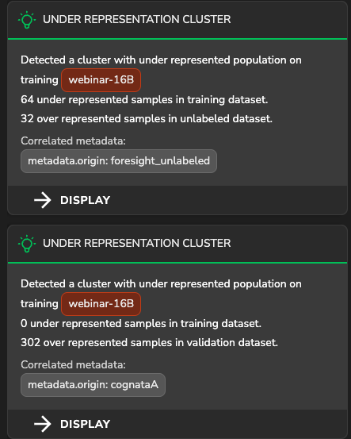

# Enhancing ADAS Object Detection with YOLOv7: Overcoming Data Shifts through Latent Space Analysis and Efficient Data Synthesis
  
Tensorleap enables efficient exploration of a model's latent space to detect data shifts in unseen samples, including unlabeled data. This repository showcases how to detect and address such issues, specifically within an object detection task for ADAS. The model developed and analyzed is [YOLOv7](https://github.com/WongKinYiu/yolov7) model. The model was trained on `Foresight` dataset. The Foresight dataset is a collection of images taken in front of parking that are installed in the front of vehicles.
Using Tensorleap, we identified shifts in the data distribution between our trained model and new, unlabeled client data encountered in production. Here we demonstrate how we identify and handle by tuning a data synthesizing process using Cognata.


### Data Shift Detection

We identify the data shift using two strategies in the platform:

1. From the Population Exploration plot, it's evident that the new samples are geometrically distinct from the original data.


2. In TL's insights panel, the new samples detected as `under-represented` cluster. 


The unlabeled data is sourced from a different camera captured by a fisheye camera. The model exhibits errors, misclassifies objects, particularly pedestrians:

<table>
  <tr>
    <td></td>
    <td></td>
  </tr>
  <tr>
    <td></td>
    <td></td>
  </tr>
</table>

### Samples Generation I 

We synthesize samples (`CognataA`) to tune our model targeting our unlabeled sample. However, there is still a major data shift as seen in the latent space:


We are also alarmed by TL insights: the generated data identified as underrepresented cluster additionally to the target sample:



### Correlated Metadata 

Analyzing external metadata variables, we observe a correlation to `red channel std`: the generated sample has higher values compared to the target data:

 Samples colored by red channel std level 
 Red channel std across the sources 


### Samples Generation II

Accordingly, we generate new images with a lower std of the red channel (`CognataB`).

 Latent space contains the new generated data (`CognataB`)
 Samples colored by red channel std level
 Red channel std across the sources including new generated data


### Data Quality Evaluation

Now, the new synthesized samples (in green) are more closely aligned to the target data (in yellow):

 

Additionally, we can further tune the generated samples by selecting based a threshold of distance from the target centroid or by another similarity metric. Another option is using an image feature metadata that is correlated to the distance. For instance, using 'color temperature' as seen in below. We can iteratively generate the samples while tuning the image 'color temperature' until reaching satisfactory convergence.

 Samples colored by `color tempratue` level


# Getting Started with Tensorleap Project

This quick start guide will walk you through the steps to get started with this example repository project.

## Prerequisites

Before you begin, ensure that you have the following prerequisites installed:

- **[Python](https://www.python.org/)** (version 3.7 or higher).
- **[Poetry](https://python-poetry.org/)**.
- **[Tensorleap](https://tensorleap.ai/)** platform access. To request a free trial click [here](https://meetings.hubspot.com/esmus/free-trial).
- **[Tensorleap CLI](https://github.com/tensorleap/leap-cli)**.


## Tensorleap **CLI Installation**

with `curl`:

```
curl -s https://raw.githubusercontent.com/tensorleap/leap-cli/master/install.sh | bash
```

## Tensorleap CLI Usage

### Tensorleap **Login**

To login to Tensorleap:

```
tensorleap auth login [api key] [api url].
```

- API Key is your Tensorleap token (see how to generate a CLI token in the section below).
- API URL is your Tensorleap environment URL: https://api.CLIENT_NAME.tensorleap.ai/api/v2

<br>

**How To Generate CLI Token from the UI**

1. Login to the platform in 'CLIENT_NAME.tensorleap.ai'
2. Scroll down to the bottom of the **Resources Management** page, then click `GENERATE CLI TOKEN` in the bottom-left corner.
3. Once a CLI token is generated, just copy the whole text and paste it into your shell.


## Tensorleap **Project Deployment**

To deploy your local changes:

```
leap project push
```

### **Tensorleap files**

Tensorleap files in the repository include `leap_binder.py` and `leap.yaml`. The files consist of the  required configurations to make the code integrate with the Tensorleap engine:

**leap.yaml**

leap.yaml file is configured to a dataset in your Tensorleap environment and is synced to the dataset saved in the environment.

For any additional file being used, we add its path under the `include` parameter:

```
include:
    - leap_binder.py
    - squad_albert/configs.py
    - [...]
```

**leap_binder.py file**

`leap_binder.py` configures all binding functions used to bind to Tensorleap engine. These are the functions used to evaluate and train the model, visualize the variables, and enrich the analysis with external metadata variables

## Testing

To test the system we can run `leap_test.py` file using poetry:

```
poetry run test
```

This file will execute several tests on leap_binder.py script to assert that the implemented binding functions: preprocess, encoders,  metadata, etc,  run smoothly.

*For further explanation please refer to the [docs](https://docs.tensorleap.ai/)*


